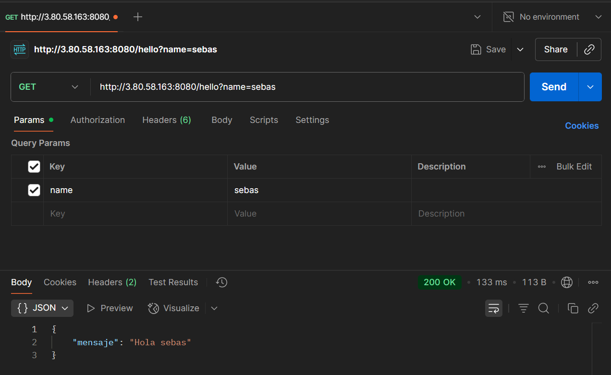
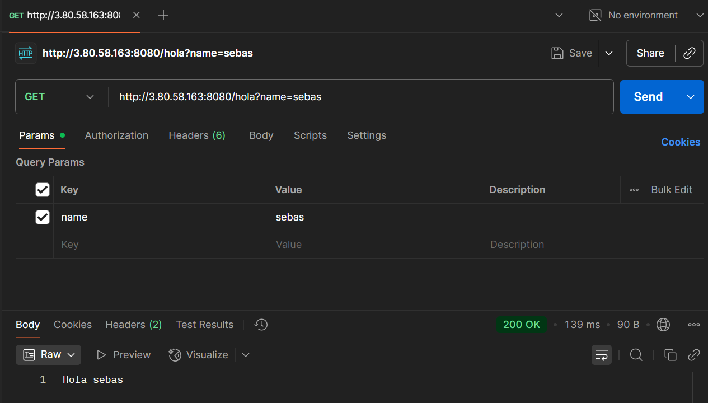
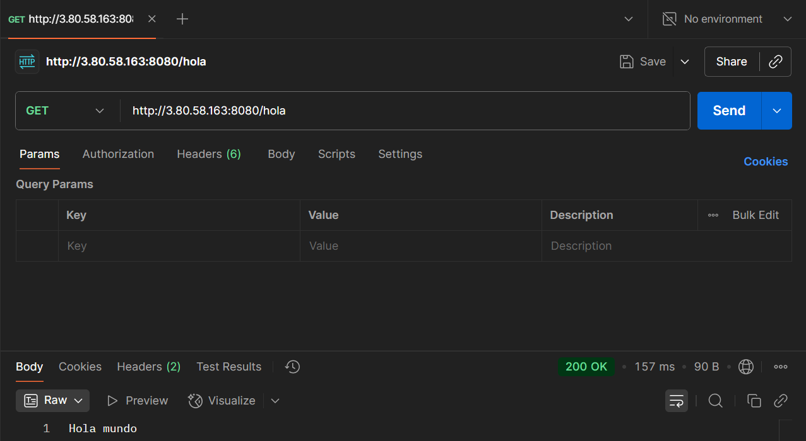
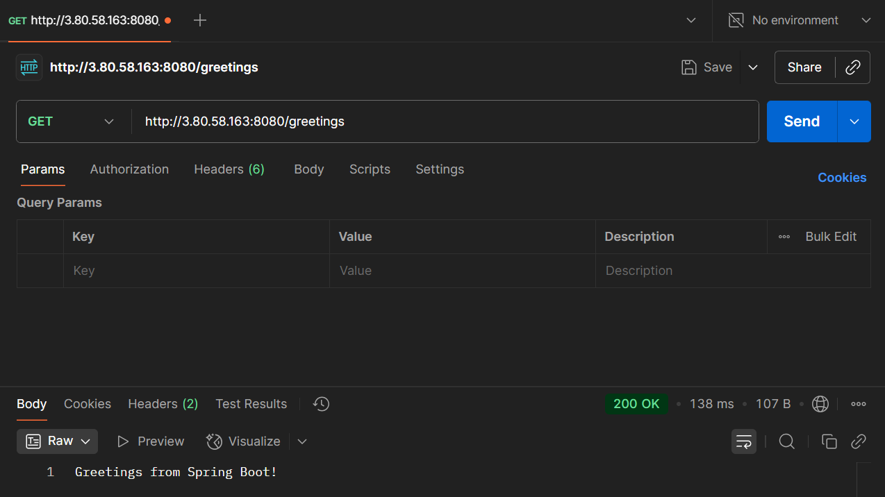
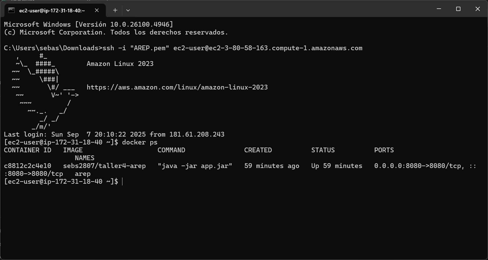

# Taller 4 - AREP  
**Servidor usando un MicroSpringBoot con despliegue en Docker y AWS**  

## 📌 Resumen del proyecto  
Este proyecto implementa una versión simplificada de **Spring Boot**, llamada **MicroSpringBoot**, que permite:  
- Definir controladores usando anotaciones personalizadas (`@RestController`, `@GetMapping`, `@RequestParam`).  
- Exponer servicios REST de manera automática al escanear paquetes con la librería **Reflections**.  
- Servir archivos estáticos desde una carpeta `www`.  
- Desplegar la aplicación dentro de un contenedor Docker.  
- Ejecutar el contenedor en una máquina virtual de AWS EC2.  

---

## 🏗️ Arquitectura  
La arquitectura sigue un diseño **cliente-servidor**, donde:  
- **Cliente:** hace peticiones HTTP.  
- **MicroSpringBoot:** recibe las solicitudes, las enruta a controladores anotados y responde con datos JSON o texto plano (dependiento de la ruta).  
- **Archivos estáticos:** servidos desde la carpeta `www`.  
- **Docker:** encapsula la aplicación en una imagen portable.  
- **AWS EC2:** proporciona la infraestructura para ejecutar el contenedor accesible desde Internet.  

**Diagrama simplificado:**  
[Diagrama](https://drive.google.com/file/d/1Nn-GXYpnfKOZ8heP68pTenOTQelLmfiZ/view?usp=drive_link)
---

## 🎨 Diseño de clases  
- **MicroSpringBoot:** punto de entrada, escanea los controladores y arranca el `HttpServer`.  
- **HttpServer:** servidor HTTP concurrente, maneja las peticiones, enruta servicios y sirve archivos estáticos.  
- **HttpRequest / HttpResponse:** abstraen la solicitud y la respuesta HTTP.  
- **Servicio:** interfaz funcional que define los métodos que manejan de rutas.  
- **Anotaciones personalizadas:**  
  - `@RestController`: marca clases que exponen endpoints.  
  - `@GetMapping`: asocia un método a una ruta.  
  - `@RequestParam`: inyecta parámetros de consulta.  
- **HelloController:** ejemplo de controlador con rutas `/hello`, `/hola`, `/greetings`.  

---

## 🐳 Generación de la imagen Docker y subirla a dockerhub 
1. Compilar el proyecto con Maven:  
   ```bash
   mvn clean package 
   ```
   Genera a su vez el ejecutable target/arep-1.0-SNAPSHOT.jar

2. Construir la imagen Docker:
   ```bash
   docker build -t sebs2807/taller4-arep .
   ```

3. Loguearse en docker hub:
   ```bash
   docker login
   ```

4. Etiquetar la imagen local con el repositorio de Docker Hub:
   ```bash
   docker tag nombre-imagen-local:latest usuario-dockerhub/nombre-repositorio:latest
   ```

5. Subir la imagen al Docker Hub:
   ```bash
   docker push usuario-dockerhub/nombre-repositorio:latest
   ```

6. Ejecutar el contenedor localmente:
   ```bash
   docker run -d -p 8080:8080 --name arep sebs2807/taller4-arep
   ```

## ☁️ Despliegue en AWS EC2
1. Conectar a la instancia EC2 vía SSH. 
   ```bash
   ssh -i "AREP.pem" ec2-user@ec2-3-80-58-163.compute-1.amazonaws.com
   ```

2. Registrarse en docker hub desde el terminal:
   ```bash
   docker login
   ```

3. Correr el contenedor exponiendo un puerto público:
   ```bash
   docker run -d -p 42000:8080 --name arep sebs2807/taller4-arep
   ```

4. Acceder desde el navegador con la IP pública de la instancia:
   
   [http://<IP_PUBLICA>:42000/hola](http://3.80.58.163:8080)

## 📸 Pruebas realizadas

Prueba en el mismo ordenador que se realizó el trabajo


Prueba desde el celular en la misma red


Prueba desde celular en diferente red


Respuesta de /hello con y sin parámetro.



Respuesta de /hola con y sin parámetro.



Respuesta de /greetings.


Vista del contenedor corriendo en AWS (docker ps).


## 🎥 Video

